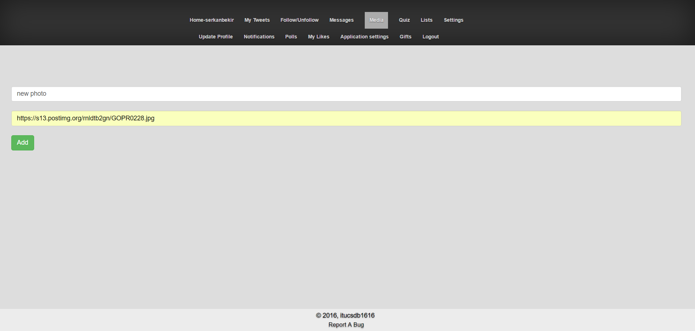
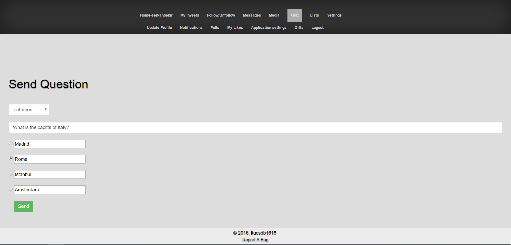

Parts Implemented by Serkan Bekir
=================================

In **Send message** page, user can send new message for a selected user which has already registered.
As it is shown below.

      User can select the other user who want to send message in dropdown menu and write the context
      of the message in the area below the dropdown menu.

In this page, user can **view messages** which are sent or are received by him. Also user can go to
the **send message** for clicking new message page or user can select the message that desired to delete
and click delete button for **delete** operation.

      All messages that belongs to current user are show. The sent messages are indicated with an
      arrow at the beginning of the message content.

In this **media** page, user can **add** new photo, **update** current photos, **tag** some user to
the photos or **delete** a photo.

      Options for media operations.

In **add photo** section, user can add a new photo and can write a description to that photo as it
is shown in the figure below.

      In the upper input user can write a description and in the input below user can write a url
      for the photo that wanted to add.

The photo which is added appears like this in the media menu as shown below.

      Media menu with added photos.

When user clicks the **update photo** button the screen which is shown below, appears. As it is shown
user can update the description of photos in this part. User should choose the photo that wants to
update and then write a new description to it.

      Update photo page

In this page user can **tag** another user for a certain photo. First, user has to choose one photo
that wants to tag and then user should choose another user for tag from the dropdown menu.

      Tag photo page

After all the operations have done(**add**, **update**, **tag**). The **media page** is shown as below.

      Media page

In this **send question** page, user can send questions for other users for challenge them. Firstly,
user has to choose another user from dropdown menu and types the question. After that put 4 options
for the question and choose one of them as correct answer. As it is shown below.

      Send question page

The sending questions are shown in the **quiz page**. As it is seen, the question was sent to **cetineris**
and when he logged in he can see the question in his page.

      Quiz page

After the user has answered the question correctly, total points of the user is updated and added 5
points for each correct answer.

      Updated points of the user

