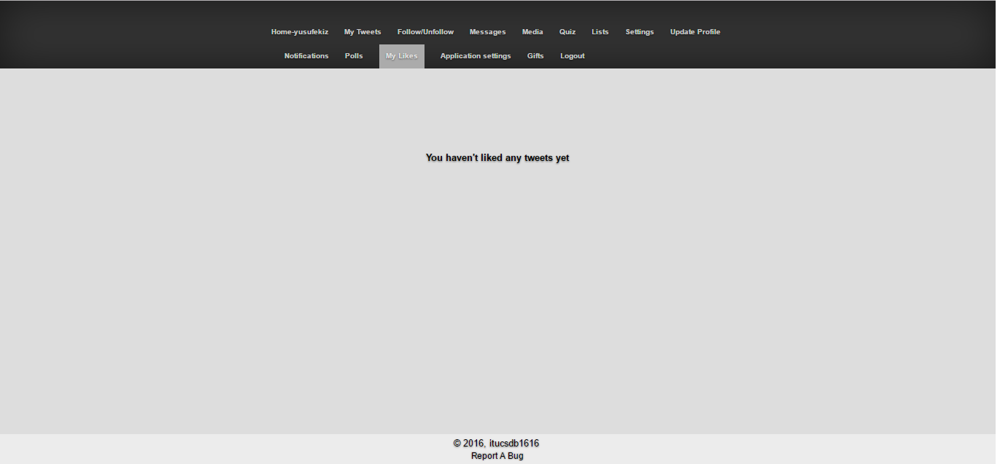

Parts Implemented by Yusuf Ekiz
===============================

LISTS
-----
In **LISTS** page the user can see 3 types of lists in application.When user clicks *Created*, the lists which are created by the current user will be shown.
When user clicks *MemberOf*,the lists  that current user has a insider role in it, and finally *Subscribed to* will show the lists which have current user as a subscriber member.

      User can create a new list with Create A List Button. Button will not work without textbox input.
      User can view also the 3 list types which are explained above.

New list is created. It can be seen below.

Every list has also its own page.For lists there are 2 perspectives. The first one is  owner perspective, other one is visitor perspective.

Owners can delete the list, change its name and add insiders.

Visitors can only subscribe the list, they don't have a right to do anything else.

POLLS
-----
In **POLLS** page the user can see all of the polls created in the application.

Initially polls index page is empty. But user can add a poll to the application with Add A Poll button.

After adding a poll in polls index page every poll's question and their owners are shown.

Also every poll has its own page. For these pages also we have 2 perspectives. First perspective is creator,other one is normal user.

Initially there are no choices in the poll, but the creator of the owner can add choices to the poll. Also the owner user can change the question.

After adding choice operations both owner and normal users can vote for the poll. Also for every choice number of the votes can be seen next to choice content.

**Normal User Perspective**

After vote it can be seen like below

MY LIKES PAGE
-------------
Initially MY Likes page are empty. It doesn't show any tweets until current user likes a tweet.

Here it is an example of a liking a tweet.

Before like operation numberoflikes is 0 and there is no unlike button. There is only like button.

**Initial Tweet Page**

After tweet is liked. Number of likes increases by 1. And the tweet is also added to the My Likes page.

**Tweet Page After Like**

**My Lıkes Page After Like**

.. figure:: member3images/aftermylikespage.png
      :scale: 50 %
      :alt: map to buried treasure
