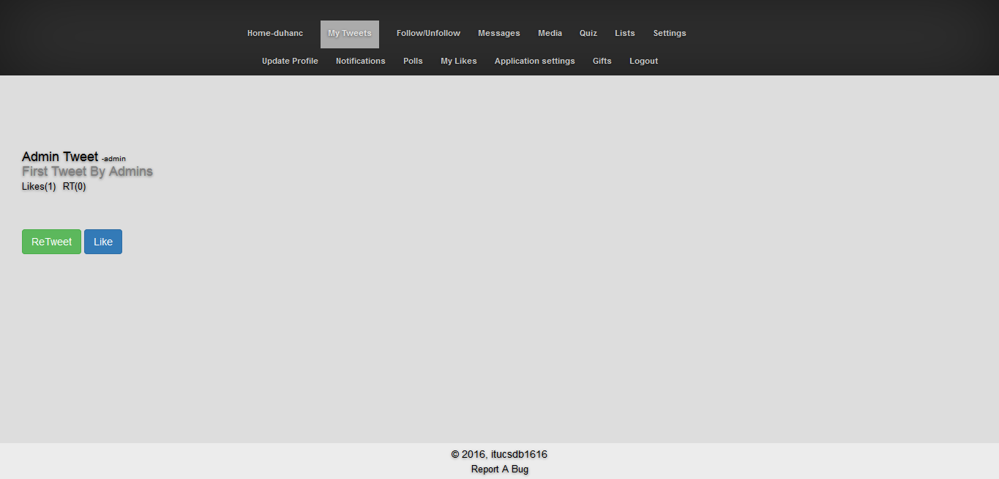
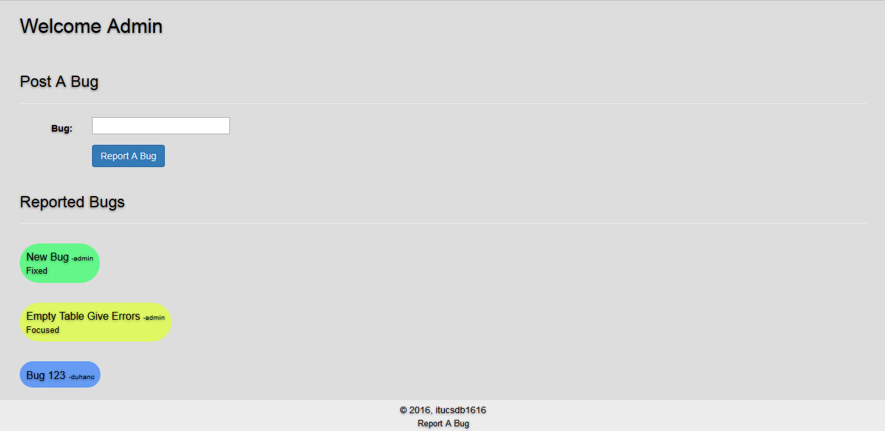

Parts Implemented by Cem Karagöz
================================

**Every user**, has a ability to post tweets to the site whether if user is admin or just a ordinary one.
Posting process can be seen below:

      Tweeting for all users

**Everyone** has a unique my tweets page depending on their tweets and retweets on this page every user can see their tweets and retweets.

.. figure:: member5png/mytweetpage.png
      :scale: 60 %
      :alt: map to buried treasure

      MyTweets Page

Also **every tweet** has a unique number and page dedicated page for its own. Which differ depending if user is its owner or not.
If user owns the tweet user will see **Delete**, **Update** options.

      Tweet Owner View

If the user is not own the tweet user can only see **ReTweet** and **Like** options.

      Tweet Guest View

Also every tweet has its own **Link(s)** that lead people to outside source(s) or picture(s).
Also every link has two views like tweet and has same abilities.

      Link Guest View

      Link Owner View

Also every user admin or ordinary one has ability to report bugs that distrupts user comfort. Report bug prompt is added to footer of every page for easy access.

      Report Link at the footer

Every user except **Admin** cannot see what bug(s) are reported. Every user has same page for posting bugs.

      Report Link at the footer

When a **admin** logs in reported bugs page will appear at navbar as seen below.

      Admin navbar

      User navbar

Here is the **Admin Perspective Of Repored Bugs Page** also every report has tree stage **Normal**, **Focued**, **Fixed** for tracking and dealing with bugs.

      Admin Report Page

